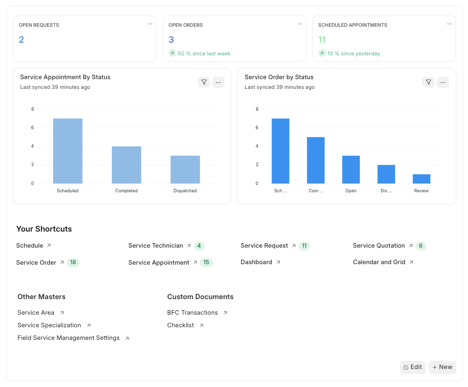
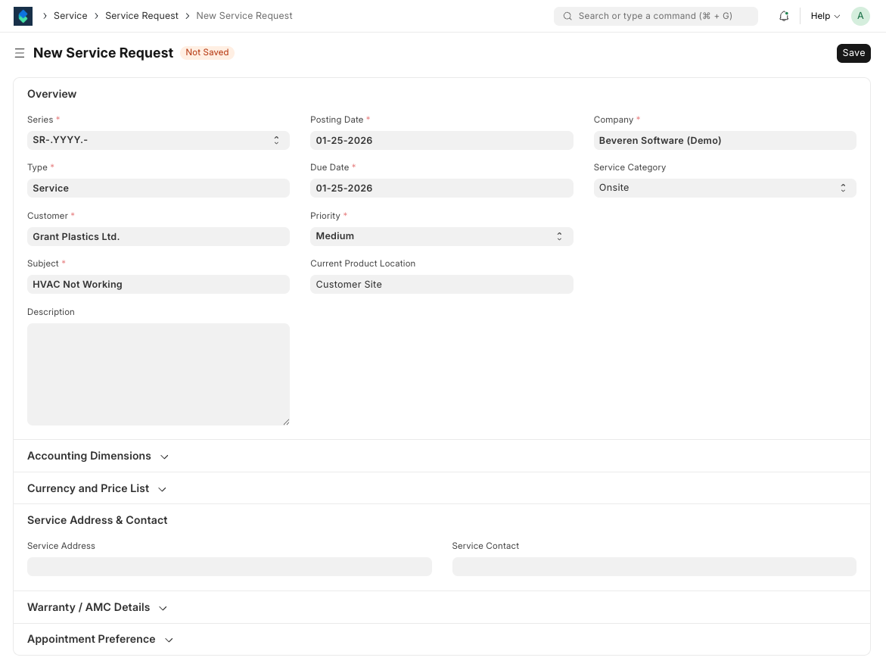
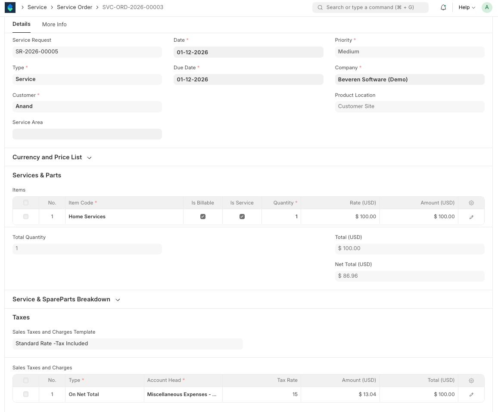
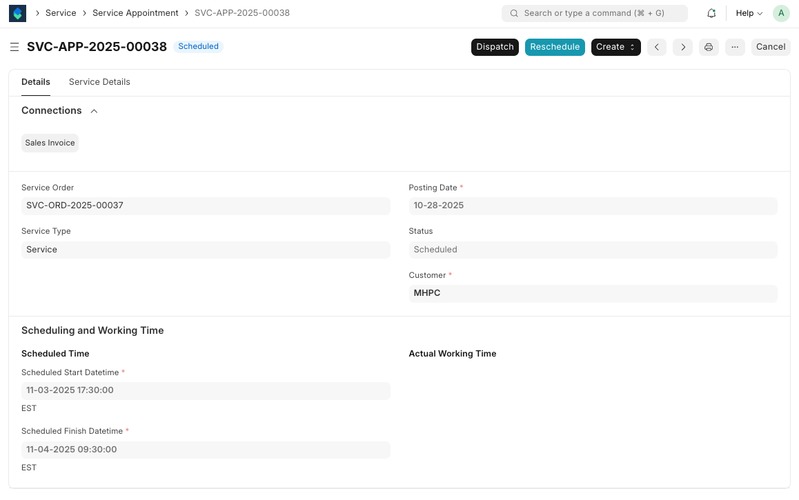
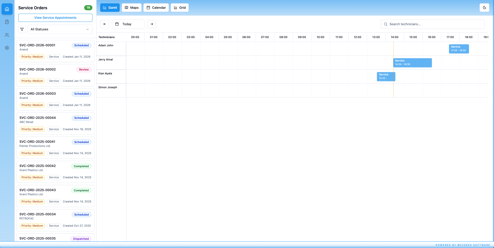

<div align="center" markdown="1">

<!--  -->
<h1>Beveren FSM (Field Service Management)</h1>

[](https://github.com/Beveren-Software-Inc/beveren_fsm/actions/workflows/ci.yaml) <br>

</div>

<div align="center">
  <p><strong>An ERPNext Field Service Management App for Service Businesses</strong></p>
  
  <p>
    <a href="https://beverensoftware.com/">Website</a> •
    <a href="https://github.com/Beveren-Software-Inc/beveren_fsm">GitHub</a>  •
    <a href="https://www.linkedin.com/company/beveren-software">LinkedIn</a>
  </p>
</div>

## Overview

Beveren FSM is a **100% open-source** Field Service Management app for ERPNext — simple, modern, and powerful, designed to manage end-to-end service operations.

It enables service teams to log requests, schedule jobs, assign technicians, track work on-site, manage spare parts, and invoice customers — all from a single integrated ERPNext system.

## Why Beveren FSM?

Managing field service operations can be complex — multiple service requests, technician schedules, spare parts, approvals, and customer billing all need to work together. Existing ERPNext workflows are often manual or fragmented.

Beveren FSM closes this gap, offering a streamlined, modern, and fully ERPNext-integrated solution. The app ensures real-time visibility, better control, and faster response times for service businesses of any size.

## How It Works

The Beveren FSM workflow follows a logical service lifecycle:

### Service Request
Operators log requests from customers or field teams, capturing all essential details such as issue, location, and priority.

### Service Quotation (Optional)
Create a quotation for labor, travel, and parts. Approval is optional, allowing flexibility for prepaid or contract-based services.

### Service Order
Approved requests are converted into Service Orders, the central document for tracking and executing work.

### Service Appointments & Scheduling
Create appointments from the Service Order. Schedule, assign technicians, and dispatch based on priority and availability.

### On-Site Execution
Technicians start and stop work directly from the appointment, update progress, consume parts, and log service details.

### Completion & Invoicing
Once the job is completed, the Service Order is closed and invoices can be generated directly, ensuring accurate billing and full traceability.

#### Workflow Summary
```
Service Request → Service Quotation (Optional) → Service Order → 
Service Appointments → Work Execution → Invoice
```

## Screenshots

### Service Request Management


Create and track service requests from customers with all essential details.

### Service Order Processing


Centralized service order management for tracking and executing work.

### Service Appointments & Scheduling


Schedule and assign appointments to technicians with real-time updates.

### Dispatch Schedule View


Visual dispatch board for efficient technician and job assignment.

## Key Features

- ✅ **End-to-End Service Management**: From request logging to invoicing
- 🗓️ **Technician Scheduling & Dispatch**: Assign jobs efficiently
- 📦 **Spare Parts & Inventory Tracking**: Consume parts directly from stock
- 📱 **Mobile-Friendly Interface**: Technicians can update jobs on-site
- 📊 **Real-Time Status & Reports**: Monitor progress and KPIs
- 📋 **Quotation & Approval**: Optional workflow for flexible service contracts
- 🔗 **ERPNext-Native**: Fully integrated, no extra licenses required
- 🔓 **100% Open-Source**: Customize and scale to your needs

## Technology Stack

| Layer | Technology |
|-------|-----------|
| **Backend** | Frappe/ERPNext |
| **Frontend** | React 19 + TypeScript |
| **Build Tool** | Vite |
| **Styling** | Tailwind CSS |
| **State Management** | Zustand |

## Installation

### Managed Hosting

Try Beveren FSM on [Frappe Cloud](https://frappecloud.com) for hassle-free deployment.

### Self-Hosting

**Step 1: Install the app using Bench**

```bash
cd $PATH_TO_YOUR_BENCH
bench get-app https://github.com/Beveren-Software-Inc/beveren_fsm --branch develop
bench install-app beveren_fsm
```

**Step 2: Start your Bench**

```bash
bench start
```

**Step 3: Access the app**

Open your browser and navigate to `http://your-site:8000`

## Development Setup

### Backend (Frappe App)

1. **Install Frappe/ERPNext** (if not already installed)
2. **Install Beveren FSM** (follow steps above)
3. **Run Bench**
   ```bash
   bench start
   ```

### Frontend (SPA)

**1. Clone the repository:**

```bash
git clone https://github.com/Beveren-Software-Inc/beveren_fsm_spa.git
cd beveren_fsm_spa
```

**2. Install dependencies:**

```bash
npm install
# or
yarn install
```

**3. Start the development server:**

```bash
npm run dev
# or
yarn dev
```

**4. Open your browser:**

Navigate to `http://localhost:5173`

## Contributing

We welcome contributions! Here's how to get started:

1. **Fork** the repository
2. **Create a feature branch:**
   ```bash
   git checkout -b feature/amazing-feature
   ```
3. **Commit your changes:**
   ```bash
   git commit -m 'Add amazing feature'
   ```
4. **Push to the branch:**
   ```bash
   git push origin feature/amazing-feature
   ```
5. **Open a Pull Request**

### Code Quality

This app uses **pre-commit** for code formatting and linting:

```bash
cd apps/beveren_fsm
pre-commit install
```

## Support

For questions or support, please reach out:

- 📧 **Email**: [info@beverensoftware.com](mailto:info@beverensoftware.com)
- 🌐 **Website**: [beverensoftware.com](https://beverensoftware.com)
- 📚 **Documentation**: [GitHub Repo](https://github.com/Beveren-Software-Inc/beveren_fsm)

---

<div align="center">
  <a href="https://beverensoftware.com" target="_blank">
    
  </a>
  <p><sub>Built with ❤️ by Beveren Software</sub></p>
</div>
